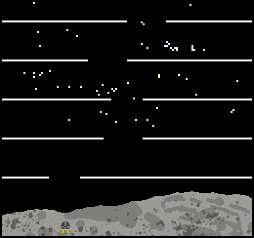

# 15-466 Game 1: Liftoff

Author: Jason Xu

Design: An Apollo-inspired obstacle avoidance game where player controls engine thrust to avoid obstacles, with implementation of 2D physics for a challenging experience.

Screen Shot:

How Your Asset Pipeline Works:
Custom assets in this game include the 16x16 lander model and the background comprised of separate lunar surface and starfield files. 

The asset pipeline starts with myself drawing the lander and background in Photoshop, then exporting the files as PNGs. For the background, I drew the surface and stars in a single PSD file with separate layers, and exporting each layer separately. The lander is exported as a single PNG file.

I then pipe these files into my parsing function, parse_assets.py. This does multiple things: it first compresses the palette of the assets into 3 colors using k-means clustering, extracting the palette in the process. Then, I use separate functions for the lander and the background. 

For the lander, I am certain that it is 4 tiles wide. So, I extract 4 tile descriptions from the image using a 8x8 array of uint8s denoting the index of the color in the palette. 

For the backgrounds, I am not certain how many tiles it might take. So, I wrote a function to compress and enlarge the image with loss of fidelity at different scales until the number of distinct tiles needed for this image is lower than a set threshold. Then, I list the tiles in a tile list similar to the format used in the lander, and a 64x60 uint8 array denoting the tile table index for every tile in the background.

The above arrays are then formatted and generated into an hpp file, generated_assets.hpp, which is used by the game code. In the game, there are helper functions to turn the stored format into the bit1/0 arrays and tile table formats used by the PPU. I also blend the 2 separate backgrounds together by replacing all transparent tiles in the moon surface background with the star background.

Drawn files are included in the imgs/ directory, and the original PSD files are included in the psds/ directory.

How To Play:
The player starts at the bottom left of the screen, and must reach the top while avoiding the white bars. There are 6 levels corresponding to the number of barriers on the screen. The player can control the thrust of the lander by pressing the arrow keys. The lander will accelerate in the direction of the thrust at a defined rate, with the upwards thruster 2 times as powerful as the left and right thrusters. When no thrust is applied, the lander will continue in its direction at its current velocity following the first law of physics, and fall following the rules of gravity. If you hit the barriers, you will be reset to the starting position on the same level. If you succeed in reaching the top, you will be reset to the starting position on the next level. If you reach the top of the last level, you will be reset to another random course with the same difficulty.

It is recommended to apply thrust gently by avoiding long presses on any key. It would be much harder to cancel out a large velocity in any direction.

This game was built with [NEST](NEST.md).

